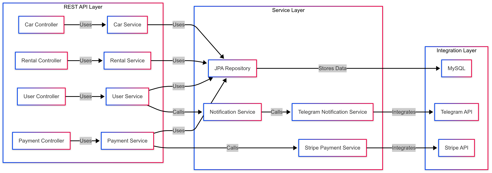

# Car-Sharing-App

### Introduction
The Car-Sharing-App is a Java-based web application built using the Spring Boot framework.
It serves as a comprehensive platform for managing users, cars, user roles, rentals,
notifications and payments. This project was inspired by the need for an efficient and scalable solution to
streamline car sharing operations.

### ARCHITECTURE



### Technologies Used
* **Spring Boot**: Is a powerful framework for building production-grade Java Applications.
* **Spring Security:** Is a powerful and highly customizable authentication and access-control
  framework.
* **Spring Data JPA:** Simplifies the implementation of JPA-based (Java Persistence API) repositories.
* **Hibernate:** ORM tool for Java applications.
* **MySQL:** A relational database management system.
* **Liquibase:** Database schema migration tool.
* **Docker:** Docker helps developers build, share, run, and verify applications in containers.
* **Lombok:** A library to reduce boilerplate code in Java.
* **MapStruct:** Implements mapping between DTOs and entity models.
* **Swagger:** Tool for API documentation and testing.
* **Stripe:** Payment system.
* **Telegram Bots:** Framework for building Telegram Bots.

### Functionality
* User registration, login, and role-based authorization allows different user levels to have
  appropriate access and capabilities within the service.
* Multiple endpoints with user and admin access enables different functionalities and
  operations for both users and administrators.
* Telegram bot notifications provides users with timely updates about the rental status,
  payments, and changes in the condition of the cars, ensuring that users are always informed.
* Integration with Stripe payment service offers secure and reliable transactions for car
  rentals, improving the user experience and trust in the service.
* Car booking and management enables users to conveniently book, use, and return rental cars,
  with all the necessary details tracked within the service.

### **GENERAL INFO**
**In this application we have the following models:**

- **User:** Contains information about the registered user (data for authentication and roles (customer or manager)).
- **Car:** Contains information about cars (brand, model, type, inventory, and daily fee).
- **Rental:** Represents a rental (car, user, rental date, planned return date, and actual return date).
- **Payment:** Payment for rental, which represents status of the payment, its type, and Stripe session.

### Models
1. Car:
  - Model: String
  - Brand: String
  - Type: Enum: SEDAN | SUV | HATCHBACK | UNIVERSAL
  - Inventory (the number of this specific car available for now in the car sharing carsharingservice.service): int
  - Daily fee: decimal (in $USD)
2. User (Customer):
  - Email: String
  - Password: String
  - First name: String
  - Last name: String
  - telegramChat id: Long
  - Role: Enum: MANAGER | CUSTOMER
3. Rental:
  - Rental date: LocalDate
  - Return date: LocalDate
  - Actual return date: LocalDate
  - Car id: Long
  - User id: Long
4. Payment:
  - Status: Enum: PENDING | PAID
  - Type: Enum: PAYMENT | FINE
  - Rental id: Long
  - Session url: Url # URL for the payment session with a payment provider
  - Session id: String # ID of the payment session
  - Amount to pay: decimal (in $USD)  # calculated rental total price

### Controllers

1. Authentication Controller:
  - POST: /login - get JWT tokens
  - POST: /registration - register a new user

2. Users Controller: Managing authentication and user registration
  - PUT: /users/{id}/role - update user role
  - GET: /users/me - get my profile info
  - PUT: /users/me - update profile info
  - DELETE: /users/{id} - delete user

3. Cars Controller: Managing car inventory
  - POST: /cars - add a new car
  - GET: /cars - get a list of cars
  - GET: /cars/{id} - get car's detailed information
  - PUT: /cars/{id} - update car (also manage inventory)
  - DELETE: /cars/{id} - delete car

4. Rentals Controller: Managing users' car rentals
  - POST: /rentals - add a new rental
  - GET: /rentals/{id} - get specific rental
  - PUT: /rentals/{id}/return - set actual return date
  - GET: /rentals?userId=...&isActive=... - get rentals by user ID and whether the rental is still active or not

5. Payments Controller (Stripe): Facilitates payments for car rentals through the platform. Interacts with Stripe API.
   Use stripe-java library.
  - POST: /payments - create payment session
  - GET: /payments/{userId} - get payments
  - GET: /payments/success/{paymentId} - check successful Stripe payments
  - GET: /payments/cancel/{paymentId} - return payment paused message

6. TelegramNotificationService Service (Telegram):
  - Notifications about new rentals created, overdue rentals, and successful payments
  - Other services interact with it to send notifications to car sharing carsharingapp.service administrators.
  - Uses Telegram API, Telegram Chat, and Bot.

### Setup Instructions
#### Local Setup

- **Clone the Repository:**
Clone the repository onto your local machine.

- **Stripe Test Account:**
Sign up for a free Stripe test account at Stripe Dashboard and obtain your STRIPE_SECRET_KEY.

- **Telegram Bot:**
Create a custom Telegram Bot via BotFather in Telegram. Retrieve the TELEGRAM_BOT_TOKEN and TELEGRAM_CHAT_ID. 
- After obtaining your token, try pasting this string into your browser:

- **https://api.telegram.org/bot<YOUR_BOT_TOKEN>/getMe** and you can get "id":xxxxxxxxxx
  TELEGRAM_CHAT_ID = xxxxxxxxxx

- **MySQL Credentials:**
Open the file application.properties and set your MySQL username and password.

- **Configure Stripe Properties:**
Edit the file application.properties by inserting your STRIPE_SECRET_KEY.

- **Configure Telegram Bot Properties:**
Modify the file application.properties with your TELEGRAM_BOT_TOKEN and TELEGRAM_CHAT_ID.

- **Build and Run:**
Compile and run the project on your local machine.

#### Docker Setup

- **Install Docker:**
Make sure Docker Desktop is installed on your system.

- **Configure Environment Variables:**
Edit the file .env_stub with your credentials: MYSQLDB_USER, MYSQLDB_ROOT_PASSWORD, STRIPE_SECRET_KEY, TELEGRAM_BOT_TOKEN, and TELEGRAM_CHAT_ID.
Rename this file to .env.

- **Build the Project:**
Compile the project.

- **Start Docker:**
Launch Docker Desktop and then, in your project directory, run the command:
**docker compose up**

#### API Documentation and Authentication

- **Swagger Documentation:**
Access the Swagger UI at http://localhost:8087/swagger-ui/index.html.

- **JWT Authentication:**
The API uses JWT for authentication. To access protected endpoints, first register and log in to receive a JWT token. Include this token in the Authorization header of subsequent API requests.

#### Default User Accounts

After the first launch, the application automatically registers two user accounts. You can log in using any of these accounts:
```json
  [{
    "email": "admin@com.net",
    "password": "1234",
    "firstName": "Admin",
    "lastName": "Admin"
  },
  {
    "email": "alice@com.net",
    "password": "1234",
    "firstName": "Alice",
    "lastName": "Alice"
  }]
```

### Conclusion
Car-Sharing-App is an innovative RESTful web application tailored to address car rental needs.
Developed using Spring Boot and Java, the application strictly follows the principles of the REST architectural style,
ensuring stateless communication between clients and the server. 